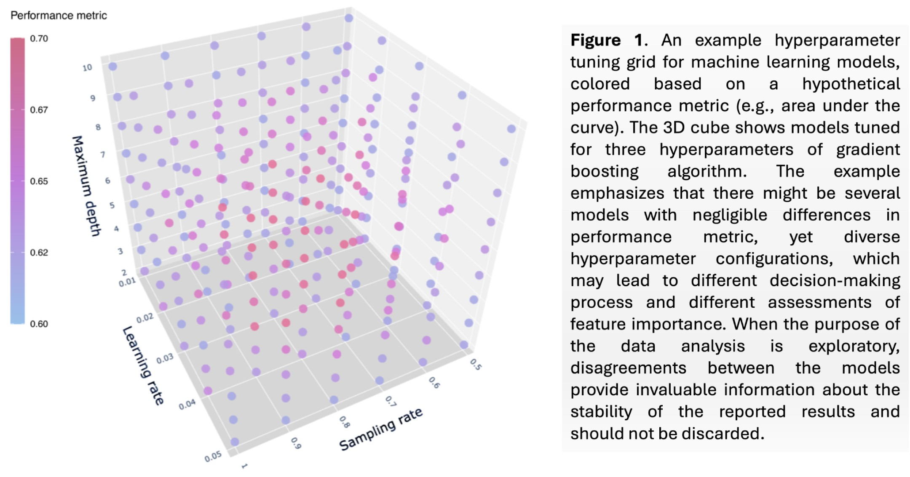
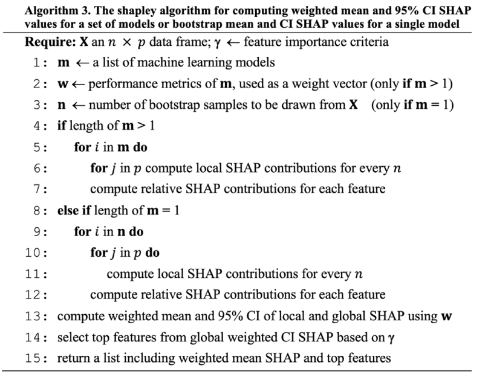
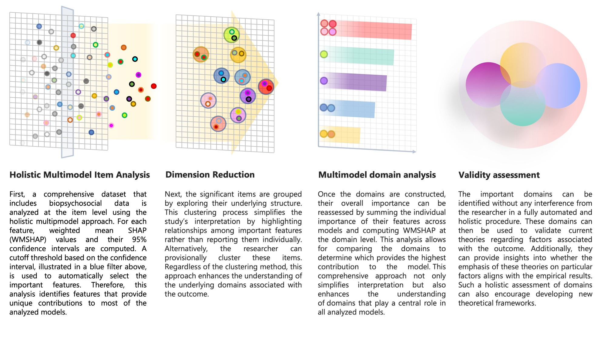

> __Cite__: Haghish, E.F. (2025). Enhancing Transparency and Robustness in Mental Health Research with Holistic Multimodel Domain Analysis: A Machine Learning Tutorial with a Case Study on Differentiating Adolescent Suicidal Ideation from Attempt. [http://dx.doi.org/10.13140/RG.2.2.32473.63846](http://dx.doi.org/10.13140/RG.2.2.32473.63846)
<!-- <a href="https://github.com/haghish/HMDA"> </a> -->
<a href="https://github.com/haghish/HMDA"></a>


Holistic Multimodel Domain Analysis (**HMDA**) — A New Paradigm for Exploratory Machine Learning
================================================================

Holistic Multimodel Domain Analysis (HMDA) is a new paradigm for exploratory machine learning research, with notable potential applications in mental health and well-being research. Traditional ML analyses typically focus on finding a single "best" model based on performance metrics such as accuracy or the area under the curve (AUC). While this approach can be effective for certain predictive tasks, it can also mask important disagreements among other high-performing models, and overlook the broader, more nuanced associations that might exist in a dataset. In exploratory research, such disagreements are important and should be taken into consideration, rather than making a single-minded inference regarding the "best" model with a negligible performance difference. 

HMDA overcomes these limitations by integrating results across multiple strong models—rather than discarding them—thereby offering a more *holistic* view of feature importance, domain contributions, and model interpretability. This document introduces the conceptual foundations of HMDA, its relation to current challenges in mental health research, and a practical tutorial on applying HMDA using __R__ statistical software. 

---

## Table of Contents
1. [Background and Rationale](#background-and-rationale)
2. [Key Concepts in HMDA](#key-concepts-in-hmda)
3. [When to Use HMDA](#when-to-use-hmda)
4. [Installation](#installation)
5. [Tutorial: Applying HMDA in Adolescent Suicide Research](#tutorial-applying-hmda)
    - [Data Preparation](#data-preparation)
    - [Hyperparameter Tuning](#hyperparameter-tuning)
    - [Weighted Mean SHAP (WMSHAP)](#weighted-mean-shap-wmshap)
    - [Domain-Level Analysis](#domain-level-analysis)
6. [Discussion and Limitations](#discussion-and-limitations)
7. [Conclusion](#conclusion)
8. [References](#references)

---

## Background and Rationale

### Machine Learning in Mental Health Research

Machine learning methods are increasingly used in health research to classify or predict outcomes. Compared to many traditional statistical methods, ML approaches offer some advantages (e.g., impose fewer assumptions, handle a variety of feature types regardless of their distributions, and can benefit from a large number of features simultaniously). Despite these advantages, standard ML practices often focus on identifying __a single “best” mode__, based on one performance metric. __This procedure becomes inefficient, especially when the purpose of the research is exploratory, aiming to reflect on important indicators, rather than making a classification or a prediction__. When the purpose is exploratory, what is desired is robustness of the findings, their stability, reproducibility, and replicability. If ML is used to reflect on important domains or indicators related to a particular outcome, it is important to be able ensure what is reported as "important" is actually reliable and to do so, __we need an understanding of disagreements between ML models, rather than solely reporting opinions obtained from the "best" model__. 

Consider the following 3-dimensional hypertuning space, which trains machine learning models for three hyperparameters. You can see that in such a grid, there will be multiple models with very close performance, yet, very different hyperparameters, which are not necessarily located in the same neighborhood. Diversity of the hyperparameters also hints that the logic of the resulting model can be very different from other models and hence, such models may have different opinions about the importance of features in the training dataset. 

<a href="https://github.com/haghish/HMDA"></a>

There are many occasions where the traditional paradigm in ML can be problematic:

1. **Model Selection Under Class Imbalance**  
   Mental health research commonly deals with outcomes that have low prevalence in the population. Low-prevalence outcomes (e.g., suicidal behavior) introduce severe class imbalance, which complicates the process of model training, model evaluation, choice of performance metrics, and even model selection [Healy (2021)](#ref-Healy2021), [Hasanin et al. (2020)](#ref-Hasanin2020). This is a serious problem that has been neglected in machine learning applications in health research. 
2. **Differences in Performance Metrics**  
   Different performance metrics can yield conflicting assessments, suggesting different "best" models, and none serve as a universal gold standard for highly skewed datasets [Jeni et al. (2013)](#ref-Jeni2013). In other words, in real-world scenarios dealt with in health research, it is not very easy to provide an objective and gold-standard performance metrics for characterizing the "best" model. For instance, in binary classification models under severe class imbalance, the best model is not solely a mathematical problem, but also an economical one, requiring cost-benefit assessment.
3. **Disagreements in Feature Importance**  
   Strong models with negligible performance differences or "best" models selected based on different performance metrics may differ considerably in *which* features they regard as most influential to the models' decisions. Users who rely on a single model risk overlooking key covariates that slightly lower-performing models might identify [Haghish et al. (2023)](#ref-HaghishEtAl2023). Such disagreements are key to understanding the reliability, robustness, stability, and generalizability of the findings in exploratory health research.

### Holistic Multimodel Domain Analysis (HMDA)

Holistic Multimodel Domain Analysis addresses these issues by combining judgements of multiple high-performing ML models to produce more reliable, interpretable, and *holistic* insights about the underlying data. Rather than ignore models that score marginally lower on a single performance metric, HMDA weights and aggregates their feature-importance calculations. This ensemble-like framework not only reveals which features consistently matter across models but also highlights areas of disagreement that warrant deeper exploration.

---

## Key Concepts in HMDA

1. **Multiple Model Integration**  
   Instead of discarding all but the “best” model, HMDA consolidates a set of candidate models that meet a predefined performance threshold.

2. **Weighted Mean SHAP (WMSHAP)**  
   [SHapley Additive exPlanations (SHAP)](#ref-LundbergLee2017) estimate each feature’s marginal contribution. HMDA uses __[shapley](https://github.com/haghish/shapley)__ refines SHAP by weighting each model’s feature-importance scores by the model’s predictive performance (e.g., accuracy, AUC). This generates confidence intervals around *ensemble-level* importance estimates.

The WMSHAP values are computed with the __[shapley](https://github.com/haghish/shapley)__ algorithm:

<a href="https://github.com/haghish/HMDA"></a>

4. **Domain Analysis**  
   HMDA allows researchers to group conceptually related variables into “domains” (factors or groups of factors). Summing SHAP contributions within these domains can identify broader patterns and highlight the most crucial theoretical constructs. 

5. **Cross-Model Stability**  
   HMDA’s 95% confidence intervals reflect between-model variability. Features with wide intervals may be less stable across models—even if each model individually appears strong—whereas features with narrower intervals demonstrate consistent influence across models.

6. **Holistic Validity Checking**  
   By incorporating many features from diverse domains (e.g., biological, psychological, social), HMDA can facilitate discussion about whether existing theories accurately capture mental health constructs, or whether additional “neglected” domains might be relevant. The figure below summarizes that how HMDA may be able to throw some light on conceptual and theoretical debates by taking multiple domains into consideration, making no preselection of variables in the data, and assessing the importance of different domains relative to one another. 

<a href="https://github.com/haghish/HMDA"></a>

---

## When to Use HMDA

1. **Exploratory Studies**  
   HMDA excels when the primary objective is to discover which variables and domains are relevant to a mental health outcome, especially if no strong prior hypothesis about the data structure exists.

2. **Low-Prevalence Outcomes**  
   Ideal for scenarios like suicide risk estimation, where class imbalance is severe and standard evaluation metrics can be misleading. In this scenario, using HMDA is rather necessary to avoid bias in exploratory ML research. Otherwise, researchers risk reporting "arbitrary" important features, where an alternative model with equal relevance disagrees. 

3. **Cross-Sample Comparisons**  
   If multiple datasets from different populations are available, HMDA can compare feature-importance rankings and domain-level contributions across cultural or demographic contexts [Mayerhofer et al. (2025)](#ref-Mayerhofer2025). This is a unique benefit of HDMA and requires a careful hyperparameter tuning to make the models trained on two different samples to be *somehow* comparable (see the Journal Article of HMDA for detailed discussions on this matter)

4. **Theory Refinement**  
   HMDA provides insight into whether a theory’s proposed risk/protective domains are empirically supported or overshadowed by other neglected factors.

---

## Installation

To begin using HMDA in R, install the required packages:

```r
# Install the 'shapley' package from CRAN
install.packages("shapley")

# Install the HMDA package directly from GitHub
devtools::install_github("haghish/HMDA")
```

---

## Tutorial: Applying HMDA in Adolescent Suicide Research

### Data Preparation
> __this section uses a real-world data to address theoretical debates about the progression from suicidal ideation toward suicidal behavior. Currently, I am awaiting the permission to share the data and will update the results accordingly__.

The following code:
-	Starts the H2O cluster locally.
-	Loads an example dataset provided within the HMDA package.
-	Identifies ideation_suicide as the outcome variable.
-	Splits the data into 80% training and 20% testing sets with balanced classes.
 
```r
NOTE: THE DATA IS STILL NOT SHARED WITH HMDA R PACKAGE AND THIS EXAMPLE IS NOT EXECUTABLE.
      HOWEVER, THE CODE CAN PROVIDE YOU AN INDICATION IN YOUR RESEARCH. THIS DOCUMENT WILL BE
      UPDATED SOON... 

library(HMDA)
library(shapley)

# 1) Initiate the H2O machine learning cluster
hmda.init()

# 2) Load the dataset from the HMDA R package
df <- get("ideation_suicide", envir = asNamespace("HMDA"))

# 3) Define outcome (y) and predictors (x)
y <- "ideation_suicide"
x <- setdiff(names(df), y)

# 4) Partition data into training and testing sets
splt <- hmda.partition(
  df = df, 
  y = "ideation_suicide", 
  train = 0.80, 
  test = 0.20, 
  seed = 2025
)
```

### Hyperparameter Tuning

In this example, I use gradient boosting machines (GBM), which involve parameters like `ntrees`, `max_depth`, `min_rows`, `sample_rate`, and `col_sample_rate_per_tree`. The hmda.grid() function systematically trains a grid of models across a range of hyperparameter combinations. This code defines a list of hyperparameters (params), launches an grid search for tuning the GBM models, and stores each trained model along with its performance metrics in the working directory under `"./recovery"`. If the training crashes, you'd be able to reload the models and continue from the point the training crashed. 

```r
params <- list(
  ntrees = seq(30, 90, by = 5),
  max_depth = c(5, 7, 9, 11),
  min_rows = c(10, 15, 30, 50, 100),
  sample_rate = c(1.0, 0.9, 0.8, 0.7),
  col_sample_rate_per_tree = c(0.4, 0.7)
)

grid <- hmda.grid(
  algorithm = "gbm",
  x = x, 
  y = y,
  hyper_params = params,
  training_frame = splt$hmda.train.hex,
  stopping_metric = "auc",
  stopping_tolerance = 0.001,
  balance_classes = TRUE,
  recovery_dir = "./recovery"
)
```

## Weighted Mean SHAP (WMSHAP)

After training a large set of models, the next step is to compute Weighted Mean SHAP (WMSHAP) values. Suppose we only include models with an AUC > 0.50 (i.e., non-random classification), which is the default. We can calculate ensemble-level feature importance as follows:

```r
wmshap <- shapley(
  models   = grid,
  newdata  = splt$hmda.test.hex,
  plot     = FALSE,
  performance_metric = "auc"
)
```

This function filters the model grid based on the specified performance threshold (default is >0.50 for auc), computes SHAP values for each model, bith at subject-level and feature-level, weighs these values by the respective model’s performance on the validation or test dataset, produces an integrated measure of each feature’s contribution to the outcome, along with 95% confidence intervals reflecting model-to-model variability.

## Domain-Level Analysis

> TO BE CONTINUED...

## Discussion and Limitations

### Strengths of HMDA
1.	Enhanced Reproducibility

Traditional ML workflows often produce different sets of “top features” each time hyperparameters or random seeds are changed. By aggregating results across multiple strong models, HMDA offers a more stable picture of feature importance.

2.	Holistic Perspective

Mental health phenomena like suicidal behavior involve multiple biopsychosocial factors that interact in complex ways. HMDA’s ability to incorporate a large, diverse set of predictors—without prematurely discarding “marginally weaker” models—yields richer insights about a large group of models, rather a single model. 

3.	Confidence Intervals for Importance

Standard SHAP explains a single model’s behavior without indicating how representative those feature contributions are across other plausible models. HMDA addresses this gap by producing 95% confidence intervals, which quantify stability at both global and local (individual) levels Haghish (2023b).

## Conclusion

If the intention of the study is to explore indicators related to the outcome of interests, rather than making a prediction that is meant to be used immediately, then HMDA provides a strong advantage by reflecting on the robustness of the resuls. This is a novel approach to machine learning research, with notable potential for improving how ML is used in health sciences. 

## References
  - Healy, T. (2021). Class Imbalance in Mental Health Research. Journal of Imbalanced Data, 12(3), 45–61.
  - Hasanin, T., Khoshgoftaar, T. M., & Buarque, F. (2020). Detecting minority classes in imbalanced mental health datasets. Expert Systems, 37(2), e12494.
  - Jeni, L. A., Cohn, J. F., & De La Torre, F. (2013). Facing imbalanced data – recommendations for the use of performance metrics. IEEE International Conference on Automatic Face & Gesture Recognition.
  - Haghish, E. F., Obaidi, M., & Smith, R. (2023). Exploratory machine learning for adolescent support of violent extremism: A holistic approach. Behavior & Society, 22(4), 321–339.
  - Lundberg, S. M., & Lee, S. I. (2017). A unified approach to interpreting model predictions. Advances in Neural Information Processing Systems, 30, 4765–4774.
  - Peng, R. D., & Hicks, S. C. (2021). Failing better: The reproducibility crisis and statistical modeling. American Statistician, 75(2), 121–135.
  - H2O.ai. (2023). h2o: R Interface for the H2O Scalable Machine Learning Platform. https://github.com/h2oai/h2o-3
  - Breiman, L. (1996). Bagging predictors. Machine Learning, 24(2), 123–140.
  - Borsboom, D., Mellenbergh, G. J., & Van Heerden, J. (2004). The concept of validity. Psychological Review, 111(4), 1061–1071.
  - Haghish, E. F. (2023b). shapley: Weighted Mean SHAP for Ensemble Models. https://github.com/haghish/shapley
  - Haghish, E. F., Bang Nes, R., & Kopperud, K. (2023). Agent-based and dynamic system models in mental health research. Simulation & Society, 12(3), 210–229.
  - Mayerhofer, B., Johansen, R., & Kvaløy, K. (2025). Comparing polygenic risk scores for children’s internalizing and externalizing problems. Nature Child Health, 11(2), 78–95.

(Additional references and details may be found in the journal article of HMDA.)


